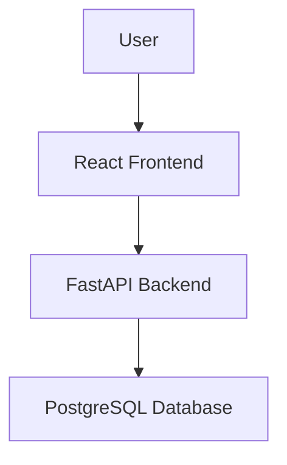

# Design Document - Simple Inventory Tracker

## One-line Description
A simple web application to track inventory items, quantities, and categories, built with React, FastAPI, and PostgreSQL, orchestrated with Docker Compose.

## User Personas
- **Store Manager**: Needs to quickly see what items are in stock and update quantities.

## Page Descriptions
- **Dashboard**: High-level overview of total items, total value, and low-stock warnings.
- **Inventory Management**: A searchable table of all items with actions to add, edit, or delete items.

## Mermaid Flow Diagram

## Routing Table
| Path | Component | Description |
| :--- | :--- | :--- |
| `/` | `Dashboard` | Overview of inventory status |
| `/inventory` | `InventoryList` | Full list of items with CRUD actions |

## i18n Plan
- Initial version will be in English only. Structure will support future i18n if needed.
